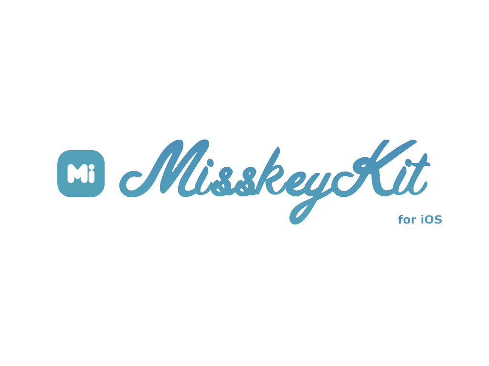

[![License][license-image]][license-url]
[![Swift Version][swift-image]][swift-url]
[](https://img.shields.io/cocoapods/v/LFAlertController.svg)
[](https://github.com/Carthage/Carthage)


## MisskeyKit for iOS

MisskeyKit is a library of [Misskey](https://misskey.io) written in swift.

You can call Misskey API almost intuitively!

<br>

Readme書いたけどまだ何も下準備してないので、これは正式公開ではないです。

中間試験終わったら正式に公開する予定です。(たぶん)

<!-- I've been writing test codes but because of problem about security I decided to postpone uploading test codes. -->

## Dependencies

- [Starscream](https://github.com/daltoniam/Starscream)
- Swift 5

<br>

## How to use

### Singleton

MisskeyKit adopts [singleton pattern](https://en.wikipedia.org/wiki/Singleton_pattern), because of keeping account information instead of developers.

So you always have to communicate MisskeyKit via the following instances.

```swift
open class MisskeyKit {
  static public let auth: Auth
  static public var notes: Notes
  static public var users: Users
  static public var groups: Groups
  static public var lists: Lists
  static public var search: Search
  static public var notifications: Notifications
  static public var meta: Meta

  static public var streaming: Streaming

```

<br>

### Authentication

There are 5 steps for authentication.

1. Access to [Developer Center](https://misskey.io/dev) and Get ```Secret Key``` (aka ```appSecret```).
2. Get a ```Session Token```.
3. User authenticates via safari.
4. Get an ```Access Token```.
5. Finally, Get an ```Api Key``` !

<!-- **TODO: web認証あたりまで一括でやってくれるようなメソッドを用意する** -->

<br>

**On the other hand, MisskeyKit is tooooo simple.**

All you need is setup and present ```MisskeyKit.auth.viewController ``` , which launchs browser for authentication and does tedious process instead of you.

Additionally, You can choose whether to use callback pattern or delegate pattern!

<br>

#### CallBack Pattern

```swift
MisskeyKit.auth.appSecret = "Enter your Secret Key"
MisskeyKit.auth.viewController.resultApiKey() { apiKey in

    guard let apiKey = apiKey else { return }
    print(apiKey) // u can get uesr's apikey.

}

MisskeyKit.auth.viewController.delegate = self
self.present(MisskeyKit.auth.viewController, animated: true)
```


#### Delegate Pattern

```swift
class ViewController: UIViewController, AuthViewControllerDelegate {

  func something() {
      MisskeyKit.auth.appSecret = "Enter your Secret Key"
      MisskeyKit.auth.viewController.delegate = self

      self.present(MisskeyKit.auth.viewController, animated: true)
  }

  //....

  func resultApiKey(_ apiKey: String?) { // Need: AuthViewControllerDelegate
      guard let apiKey = apiKey else { return }

      print(apiKey) // u can get uesr's apikey.
  }

```

<br><br>

### Authentication (Advanced)

You can also call API of Authentication in the right order.


#### Get a ```Session Token```

```swift
MisskeyKit.auth.startSession(appSecret: "Enter your appSecret") { auth, error in
    guard let auth = auth, let token = auth.token, error != nil else { /* Error */ return }

    print(token) // u got a Session Token.
}
```

After getting, you need to let your user authenticate via safari.

For example,

```swift
MisskeyKit.auth.startSession(appSecret: "Enter your appSecret") { auth, error in
    guard let auth = auth, let token = auth.token, error != nil else { /* Error */ return }

    print(token) // u got a Session Token.

    guard let url = URL(string: token.url) else { /* Error */ return }
    DispatchQueue.main.async {
      if UIApplication.shared.canOpenURL(url) {
        UIApplication.shared.open(url)
      }
    }
}
```

<br>

#### Get an ```Access Token```

```swift
MisskeyKit.auth.getAccessToken() { auth, error in
    guard let auth = auth, error != nil else { return }

    print(auth.me) // u got a Session Token.
}
```

<br>

#### Get an ```Api Key```

```swift
// If u get user's Access Token correctly, u can get Api key.
guard let apikey = MisskeyKit.auth.getAPIKey() else {

      /* Error */

}

```
<br>

### How to call API

Look into my code of MisskeyKit and see how to describe.

Oh, it's too much hassle? Hmmm... Okay, I'll give you two examples.

<br>

For example, if you wanna post a note, check the following code.

(Once you get or set user's api key, you don't have to send Api key to each methods.)

<br>

```swift

 // Type of the first parameter "posts" will change according to purpose of methods you use.
 // In this method, type is NoteModel. You can see model class in "./MisskeyKit/APIs/Model".

 MisskeyKit.notes.createNote(text: "Enter some text!") { posts, error in  
            guard let posts = posts, error == nil else { /* Error */ return }

            // MisskeyKit.notes.createNote returns information of your post that you've just posted.
            // The fact itself that you receive it means that your request was accepted successfully.

            print(posts)
}
```

Second Example: If you wanna get one hundred notes from user's timeline, write like this code.

```swift
MisskeyKit.notes.getTimeline(limit: 100) { posts, error in
            guard let posts = posts, error == nil else { /* Error */ return }

            print(posts) // You can check 100 notes if your request was accepted successfully.
}
```

<br><br>

### Streaming API

MisskeyKit also provides wrapper of a [```streaming API```](https://misskey.kurume-nct.com/docs/ja-JP/stream) as well as REST API!


(```Streaming API``` is a subscription mechanism for binding client to server so that you can receive events **in near real time**.)

<br>

```Streaming API``` adopts not HTTP protocol but WebSocket, so you need to connect to server by other methods.

However it's so easy to connect via WebSocket by MisskeyKit !　

### ```MisskeyKit.streaming.connect()```


All you have to do is just use ```MisskeyKit.streaming.connect()``` !

```swift
guard let apiKey = MisskeyKit.auth.getAPIKey() else { return }

MisskeyKit.streaming.connect(apiKey: apiKey, channels: [.main, .homeTimeline]) { response, channel, type, error in

        // Do something ...

        //apiKey: Your Api Key.
        //channels: [SentStreamModel.Channel] Type / channels which you wanna connect to.

        //This closure captures and sends you events through channels which you subscribed.
        //response: Any? Type / events itself. You have to cast it according to type(third params of callback).
        //channel: SentStreamModel.Channel? Type / shows which channel sent events.
        //type: String? Type / shows what kind of events was sent. You'll use it to cast response.
        //error: Error? Type / If something wrong happens, error is sent

}

```
<br><br>

### ```MisskeyKit.streaming.captureNote()```

Even if you use ```MisskeyKit.streaming.connect()``` and listen to events, there are some notes you cannot receive.

For these notes, you have to call API that provides you capturing functions.(Click [here](https://misskey.kurume-nct.com/docs/ja-JP/stream) for details.)

<br>

If you wanna capture some notes, use ```MisskeyKit.streaming.captureNote()```

```swift
do {
  try MisskeyKit.streaming.captureNote(noteId: "Enter note Id.")
}
catch {
   /* Error */
}
```

Once you capture a note, each events related to the note will sent to your callback method of ```MisskeyKit.streaming.connect()```.

<br><br>

### ```MisskeyKit.streaming.stopListening()```

If you want to disconnect specific channel, use ```MisskeyKit.streaming.stopListening()```.


```swift
MisskeyKit.streaming.stopListening(channnel: SentStreamModel.Channel)
MisskeyKit.streaming.stopListening(channnels: [SentStreamModel.Channel])
MisskeyKit.streaming.stopListening(noteId: String)
MisskeyKit.streaming.stopListening(noteIds: [String])
```


<br><br>


## Contribute

We would love you for the contribution to **MisskeyKit**, check the ``LICENSE`` file for more info.


## Others

Yuiga Wada -  [WebSite](https://yuiga.dev)
Twitter         - [@YuigaWada](https://twitter.com/YuigaWada)


Distributed under the MIT license. See ``LICENSE`` for more information.

[https://github.com/YuigaWada/MisskeyKit](https://github.com/YuigaWada/MisskeyKit)


[swift-image]:https://img.shields.io/badge/swift-5.0-orange.svg
[swift-url]: https://swift.org/
[license-image]: https://img.shields.io/badge/License-MIT-blue.svg
[license-url]: LICENSE
[codebeat-image]: https://codebeat.co/badges/c19b47ea-2f9d-45df-8458-b2d952fe9dad
[codebeat-url]: https://codebeat.co/projects/github-com-vsouza-awesomeios-com
